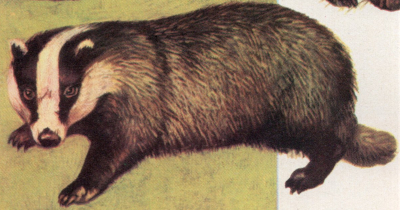

# The Great Badger Sokoban Character

A character designed for Sokoban games.

## Details

- **Author:** Carlos Montiers Aguilera
- **Creation Date:** July 11, 2026
- **License:** CC BY-SA 4.0

## The Story

I started developing an avatar that worked well against a dark gray background. I initially concluded that a Panda would be ideal, but I found the black circles around the eyes too distracting for a Sokoban skin.

Over several weeks, I tested various animal designs. Eventually, by chance, I opened an old Spanish encyclopedia and found a picture of a badger. It was described as *"a slow and placid animal that spends its life shut up almost continuously in its burrow. It generally feeds on insects, roots, acorns, and... grapes."*

It offered the black-and-white contrast I wanted. I also loved the description of the animal. That was exactly what I was looking for in a character.

## License

This work by Carlos Montiers Aguilera is licensed under the Creative Commons Attribution-ShareAlike 4.0 International License:
https://creativecommons.org/licenses/by-sa/4.0/

## Inspiration

This character design was inspired by a vintage illustration of a badger ("El Tejón") from a Spanish encyclopedia.

*Note: The original encyclopedia image is not covered by the license and remains the property of its original publisher.*
